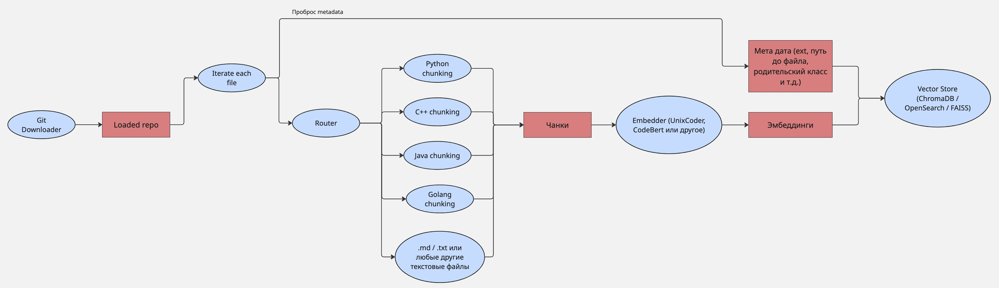
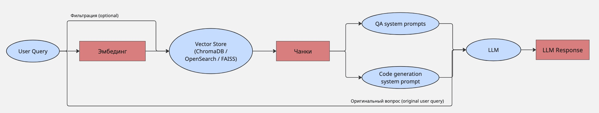

# ML System Design Doc - [RU]
## Дизайн ML системы - Code-RAG MVP 1.0
*Шаблон ML System Design Doc от телеграм-канала [Reliable ML](https://t.me/reliable_ml)*

### 1. Цели и предпосылки
#### 1.1. Зачем идем в разработку продукта?
- **Бизнес-цель** `Product Owner`:
  Создать open-source фреймворк, который упрощает и ускоряет процесс понимания незнакомых кодовых баз для разработчиков. Цель — сократить время "onboarding" в новый проект и повысить продуктивность за счет автоматизированного ассистента, способного отвечать на вопросы по коду. В рамках учебного курса — продемонстрировать навыки проектирования ML-систем.

- **Почему станет лучше, чем сейчас, от использования ML** `Product Owner` & `Data Scientist`:
  Сейчас разработчики тратят часы и дни на ручное изучение кода, чтение документации (если она есть) и общение с коллегами. ML-подход (RAG) позволяет создать "эксперта" по любой кодовой базе за минуты. Это централизует знания, делает их доступными 24/7 и позволяет получать ответы, контекстуально связанные с конкретными частями кода, что невозможно при использовании глобального поиска.

- **Что будем считать успехом итерации с точки зрения бизнеса** `Product Owner`:
  Успехом MVP будет считаться работающий прототип, который:
  1.  Успешно обрабатывает публичный GitHub репозиторий средних размеров (например, сам этот проект или небольшой фреймворк).
  2.  Дает релевантные ответы на 5-10 тестовых вопросов о структуре кода и назначении ключевых функций.
  3.  Публикация проекта на GitHub и получение первых "звезд" и обратной связи от сообщества.

#### 1.2. Бизнес-требования и ограничения
- **Краткое описание БТ и ссылки на детальные документы с бизнес-требованиями** `Product Owner`:
  Сервис должен предоставлять UI, куда пользователь вводит URL публичного GitHub репозитория. Система скачивает репозиторий, индексирует его и предоставляет чат-интерфейс для взаимодействия.
  Требования:
  - **Индексация:** поддержка `.py, .md, .cpp, .java, .go, .js`.
  - **Взаимодействие:**
    1.  Ответы на вопросы о коде на естественном языке.
    2.  Генерация кода (дополнение, рефакторинг, тесты).
  - **Архитектура:** должна быть модульной для добавления различных парсеров, моделей ранжирования и других модулей улучшения качества поиска.
  - **LLM:** поддержка любой модели через OpenAI-совместимый API.

- **Бизнес-ограничения** `Product Owner`:
  1.  **Ресурсы:** Проект разрабатывается в рамках учебного курса с ограниченным бюджетом. Предпочтение отдается open-source моделям и локальным/бесплатным векторным базам данных (ChromaDB, FAISS).
  2.  **Время:** MVP должен быть готов в рамках учебного курса.
  3.  **Безопасность:** На этапе MVP обрабатываются только публичные репозитории, вопросы приватности и безопасности кода не являются приоритетом.

- **Что мы ожидаем от конкретной итерации** `Product Owner`:
  Рабочий Streamlit/Gradio интерфейс, демонстрирующий end-to-end пайплайн: URL -> Индексация -> Ответ на вопрос.

- **Описание бизнес-процесса пилота, насколько это возможно** `Product Owner`:
  "Пилотом" будет являться демонстрация работы сервиса на известном open-source репозитории (например, `FastAPI` или `Requests`). Мы зададим заранее подготовленный список вопросов, ответы на которые можно верифицировать вручную, и оценим качество и релевантность ответов.

- **Что считаем успешным пилотом?** `Product Owner`:
  Успешный пилот — это когда система правильно отвечает как минимум на 70% общих вопросов ("За что отвечает файл `main.py`?") и на 50% специфических вопросов ("Какая функция в этом репозитории выполняет аутентификацию пользователя?").

#### 1.3. Что входит в скоуп проекта/итерации, что не входит
- **На закрытие каких БТ подписываемся в данной итерации** `Data Scientist`:
  - **Входит в MVP:**
    - Клонирование репозитория по URL.
    - Парсинг и чанкинг файлов с кодом (`.py`, `.md` в первую очередь).
    - Векторизация и сохранение в локальную векторную БД (ChromaDB).
    - Базовый RAG-пайплайн: `retrieve` -> `generate`.
    - Простейший UI для ввода URL и вопросов.
    - Поддержка подключения к LLM через OpenAI API.

- **Что не будет закрыто** `Data Scientist`:
  - **Не входит в MVP:**
    - Продвинутое обогощение контекстов метаданными: добавление Graph-RAG, суммаризация контекстов.
    - Продвинутые модули: `reranker`, `rag_fusion`, и другие компоненты улучшения поиска.
    - Сложный UI с историей чатов, управлением пользователями.
    - Поддержка приватных репозиториев и аутентификация.
    - Оптимизация под высокую нагрузку и масштабирование.
    - Инкрементальная индексация (обновление индекса при изменениях в репозитории).
    - Fine-tuning кастомных/собственных моделей.

- **Описание результата с точки зрения качества кода и воспроизводимости решения** `Data Scientist`:
  Код будет соответствовать стандартам `ruff`, покрыт pre-commit хуками. Вся настройка будет описана в `README.md`, а зависимости зафиксированы в `requirements.txt`, что обеспечит воспроизводимость.

- **Описание планируемого технического долга** `Data Scientist`:
  - Отсутствие асинхронной обработки: индексация будет блокирующим процессом.
  - Упрощенный чанкинг: на первом этапе будет использоваться рекурсивный сплиттер по символам, а не language-specific парсеры (например, `tree-sitter`).
  - Обогощение контекстов метаинформацией: при индексации репозитория каждый чанк будет иметь примитивную метаинформаицию (название файла, путь файла, родительский класс, название функции)
  - Хранение данных: использование локальной БД без персистентности между запусками.

#### 1.4. Предпосылки решения
- **Описание всех общих предпосылок решения** `Data Scientist`:
  1.  **Гипотеза RAG:** Мы предполагаем, что семантический поиск по чанкам кода с последующей генерацией ответа LLM является эффективным методом для ответов на вопросы о кодовой базе.
  2.  **Качество эмбеддингов:** Мы исходим из того, что существующие модели эмбеддингов (например, `jina-embeddings-v2-base-code` или другие open-source аналоги) способны улавливать семантику программного кода.
  3.  **Доступ к LLM:** Предполагается наличие доступа к LLM (API, vLLM).
  4.  **Структура кода:** Мы предполагаем, что код в репозиториях структурирован достаточно хорошо, чтобы разделение на функции/классы было осмысленным.

### 2. Методология `Data Scientist`
#### 2.1. Постановка задачи
- **Что делаем с технической точки зрения** `Data Scientist`:
  Мы строим систему **Retrieval-Augmented Generation (RAG)**. Задача состоит из двух этапов:
  1.  **Offline-индексация:** Создание и наполнение векторной базы знаний на основе исходного кода репозитория.
  2.  **Online-генерация:** Поиск релевантных фрагментов кода (контекста) в базе по запросу пользователя и генерация ответа с помощью LLM на основе этого контекста.

#### 2.2. Блок-схема решения
- **Блок-схема для бейзлайна (MVP):**
  (Для визуализации можно использовать Miro, Mermaid.js или draw.io)

  **Текстовое описание схемы:**

  **1. Этап Индексации (Offline):**
      - `[Input: GitHub URL]` -> **Модуль `Git Downloader`** (клонирует репозиторий во временную папку)
      - -> **Модуль `File Parser`** (рекурсивно обходит папку, читает файлы с нужными расширениями)
      - -> **Модуль `Chunker`** (делит текст файлов на чанки; **Бейзлайн:** рекурсивный сплиттер, **MVP+:** language-aware сплиттер)
      - -> **Модуль `Embedding Model`** (векторизует каждый чанк)
      - -> **Модуль `Vector Store Indexer`** (сохраняет чанки и их векторы в `Vector DB`, например, ChromaDB) -> `[Output: Готовый индекс]`

  **2. Этап Ответа (Online):**
      - `[Input: User Query]` -> **Модуль `Embedding Model`** (векторизует запрос пользователя)
      - -> **Модуль `Retriever`** (выполняет семантический поиск по `Vector DB` и находит N самых релевантных чанков)
      - -> **Модуль `Prompt Formatter`** (создает промпт для LLM, объединяя `User Query` и найденные чанки-контекст)
      - -> **`LLM API`** (отправляет промпт в большую языковую модель)
      - -> `[Output: Сгенерированный ответ]` -> **UI** (отображает ответ пользователю)

  **Визуальная блок-схема:**
  | Этап индексации (Offline) |
  | --- |
  |  |

  |  Этап ответа (Online) |
  | --- |
  |  |

#### 2.3. Этапы решения задачи `Data Scientist`
*Этот раздел будет детально заполняться по мере проведения EDA и разработки.*

**Этап 1 - Подготовка данных (Индексация)**

- **Данные и сущности:**

| Название данных | Источник данных (url) | Объём данных (кол-во индексируемых файлов) | Ти данных (датасет / репозиторий) |
|---|---|---|---|
| Библиотека requests | https://github.com/request/request | 37 | репозиторий |
| SWE-bench_bm25_13K | https://huggingface.co/datasets/princeton-nlp/SWE-bench_bm25_13K | 18.8k | датасет |

- **Краткое описание результата этапа:** На выходе должен быть сервис/скрипт, который принимает URL репозитория и создает в локальной папке персистентную векторную базу данных (ChromaDB) с проиндексированным кодом.
